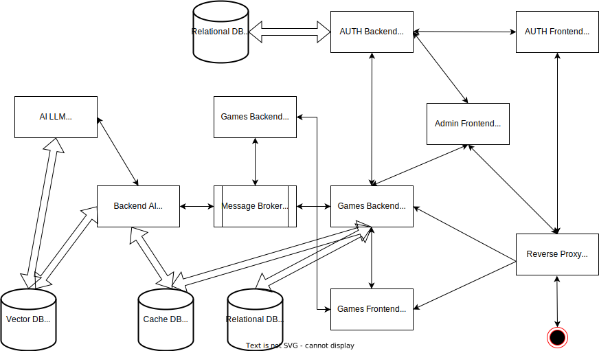

# Information Technologies Project

---

## Introduction

* Welcome to presentation! This is presentation of "Intellect Mindscape".
  *The following topics will be covered:*
  + What are Intellectual Games and Intellectual Tests?
  + Importance of Intellectual Games
  + Types of Intellectual Games
  + Benefits of Engaging in Intellectual Tests

---

## What are Intellectual Games and Tests?

  * Definition: Activities designed to challenge and enhance cognitive abilities, including problem-solving, critical thinking, and creativity.
  * Purpose: Stimulate mental processes and improve various intellectual skills.
  * Examples: Puzzles, strategy games, quizzes, and brain teasers. 

---

## Importance of Intellectual Games

  * Cognitive Development: Enhances memory, attention, and reasoning skills.
  * Social Interaction: Encourages teamwork and communication.
  * Stress Relief: Provides a fun and engaging way to relax.

---

## Types of Intellectual Games

  * Puzzles: Activities like crosswords and puzzles that require logical thinking.
  * Strategy Games: Games such as chess that involve planning and foresight.
  * Trivia Quizzes: Tests that challenge knowledge across various subjects.
  * Brain Teasers: Short problems or riddles that require creative thinking to solve.

---

## Benefits of Engaging in Intellectual Tests

  * Mental Agility: Regular engagement improves cognitive flexibility and quick thinking.
  * Learning: Encourages continuous learning.
  * Enhanced Problem-Solving: Develops skills to approach and solve complex issues effectively.

---

## Principal product structure

---

## Fast API - Auth Backend, Game Backend AI, Game Backend Chat
  - *Role*: FastAPI serves as the backend framework for building APIs. It handles incoming requests, processes business logic, and interacts with databases or other services. FastAPI is known for its high performance and automatic generation of API documentation.
  - *Features*:
    - Define API endpoints.
    - Validate and process incoming data.
    - Manage application logic and data retrieval.

---

## Keycloak - AUTH Component

- *Role*: According to current state project repository and documentation is open-source (currently Apache License 2.0) project identity and access management solution that provides authentication and authorization services (AUTH).
- *Features*:
  - Authenticate users and manage sessions.
  - Provide Single Sign-On (SSO) capabilities.
  - Handle user roles and permissions for access control.

---

## Kafka - Message Broker, Controller

- *Role*: According to current state project repository and documentation Apache Kafka is an open-source (currently Apache License 2.0) distributed event streaming platform designed for high-throughput, fault-tolerant data processing. It acts as a central hub for data flow, facilitating the integration of various services and applications.
- *Features*:
  - Provides high throughput and low latency for processing messages, making it suitable for real-time data processing.
  - Supports horizontal scalability, allowing users to easily add more nodes to the Kafka 
  - Various data processing models

---

## Gorilla Websocket - Golang WebSocket Library

- *Role*: According to current state project repository and documentation Gorilla Websocket is an open-source (BSD-2-Clause License) Golang library designed for building WebSocket applications. It provides a comprehensive framework for real-time communication between clients and servers, enabling efficient data exchange over a persistent connection.
- *Features*:
  - Supports full-duplex communication, allowing simultaneous sending and receiving of messages, which is essential for interactive applications.
  - Easy integration with existing Go applications, simplifying the implementation of WebSocket functionality.
  - Built-in support for handling connection upgrades, message framing, and control frames like ping/pong for maintaining connection health.

---

## Ollama - Large Language Models Deployment Tool

- *Role*: According to current state project repository and documentation Ollama Docker Compose LLM is an open-source (MIT License) tool designed to facilitate the deployment and management of large language models (LLMs) using Docker containers. It streamlines the process of setting up, configuring, and running LLM applications, ensuring a consistent environment for development and production.
- *Features*:
  - Simplifies the orchestration of multiple LLM services, allowing users to define dependencies and configurations in a single YAML file.
  - Supports easy scaling of language model instances to handle varying workloads, optimizing resource usage based on demand.
  - Provides seamless integration with existing Docker workflows, enabling developers to use containerization for efficient model deployment and management.

---

## Prometheus, Grafana - Performance Monitoring

- *Role*: Performance Monitoring tools like Prometheus and Kibana are essential for tracking the health and performance of applications. Prometheus collects and stores metrics data, while Kibana provides a powerful visualization layer for analyzing and interpreting that data.
- *Features*:
  - Prometheus scrapes metrics from configured targets at specified intervals.
  - Prometheus supports alerting rules that notify developers and operators of potential issues, enabling quick responses to performance degradation or outages.
  - Grafana offers intuitive dashboards and visualizations, making it easy to analyze trends.

---

## Choosing Intellect project, because - Part I

  - *High Performance*: FastAPI offers rapid request processing due to its asynchronous architecture, enabling the development of high-performance web applications.
  - *Security and Access Management*: Keycloak provides robust authentication and authorization tools, including support for OAuth2 and OpenID Connect, ensuring a high level of security.
  - *Modern User Interface*: ReactJS allows for the creation of interactive and responsive user interfaces, enhancing user experience and making the application more engaging.
  - *Flexibility and Scalability*: The microservices architecture allows for easy scaling of the application and the addition of new features without significant changes to the existing codebase.
  
---

## Choosing Intellect project, because - Part II

- *Easy Deployment*: NGINX serves as a reliable web server and reverse proxy, simplifying the deployment and management of the application while providing load balancing and caching.
- *Community and Support*: All technologies have active communities and extensive documentation, making it easier to carry out issues and implement new features.
- *Cross-Platform Compatibility*: Utilizing these technologies enables the creation of applications that work across various platforms and devices, ensuring accessibility for a wide audience.
